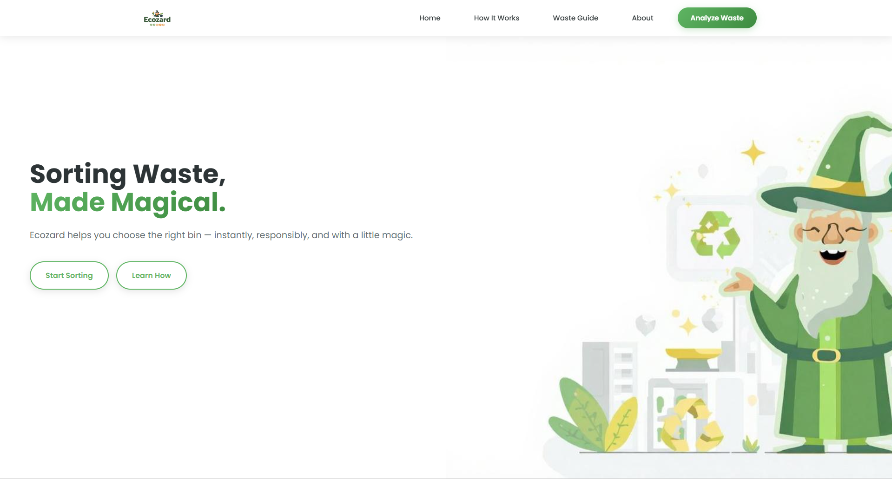
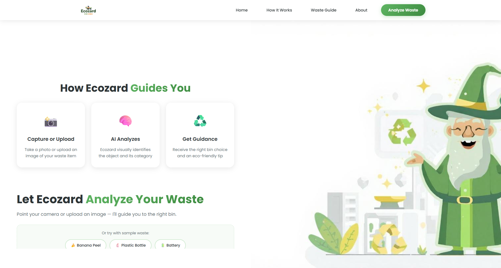
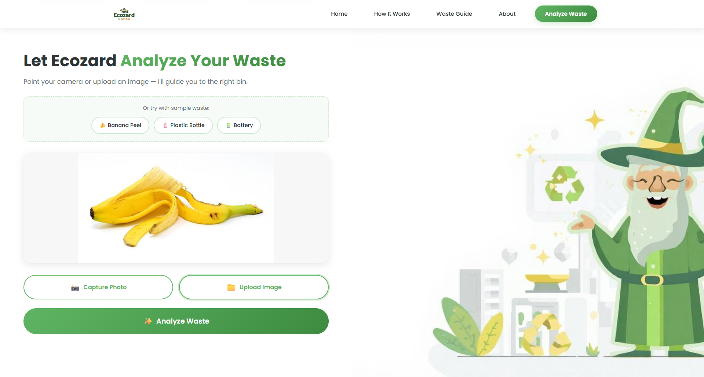
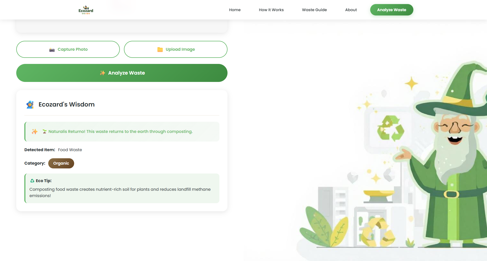
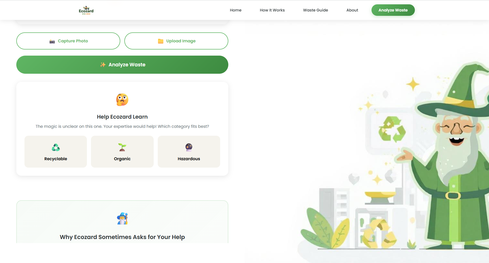

\# Ecozard – AI-Assisted Waste Segregation 🧙‍♂️♻️


Ecozard is an AI-assisted waste segregation application designed to help users

make correct disposal decisions at the moment of action. It analyzes an image

of a waste item and guides the user to dispose of it as recyclable, organic, or

hazardous waste through clear explanations and friendly wizard-style guidance.


The project aligns with \*\*SDG 12 – Responsible Consumption and Production\*\*.


---


\## Problem Statement


Incorrect waste segregation is a major reason for low recycling rates in cities.

Although many people want to dispose of waste responsibly, they are often unsure

about the correct category at the moment of disposal.


Ecozard addresses this problem by providing instant, image-based guidance that

helps users make the right choice at the right time.


---


\## Solution Overview


Ecozard acts as a personal waste-segregation assistant that:

\- Accepts an image of a waste item

\- Analyzes the image using computer vision

\- Classifies the waste into \*\*Recyclable\*\*, \*\*Organic\*\*, or \*\*Hazardous\*\*

\- Provides a short explanation or awareness tip

\- Avoids incorrect guidance by handling uncertainty responsibly


The focus of the solution is \*\*clarity and awareness\*\*, not perfect AI accuracy.


---


\## Features Implemented


\- Image-based waste analysis using a pretrained vision model

\- Waste classification:

&nbsp; - ♻️ Recyclable (Dry Waste)

&nbsp; - 🌱 Organic (Wet Waste)

&nbsp; - 🔮 Hazardous Waste

\- Confidence-based decision handling

\- User-assisted fallback when AI confidence is low

\- Short awareness tips embedded naturally in the output

\- Wizard-style guidance for an engaging user experience


---

\## AI Approach

\-Pretrained vision model

\-Rule-based mapping

\-No training done

\-AI assists, does not guess

---

\## Tech Stack


\- \*\*Python\*\*

\- \*\*Hugging Face Transformers\*\*

\- \*\*Vision Transformer (ViT)\*\* for image classification

\- \*\*Pillow (PIL)\*\* for image handling

\- \*\*Anti-Gravity\*\* (Web UI \& Interaction Layer – planned / in progress)


---


\## AI Approach


Ecozard uses a \*\*pretrained vision transformer model\*\* to analyze images and

identify visually similar objects. The model output is combined with

rule-based logic and confidence thresholds to determine the correct waste

category.


No machine learning model training was performed.


---

## Screenshots

### Landing Page


### How It Works


### Analyze Waste


### Result – Clear Case


### Result – Uncertain Case



---

\## Dataset Usage \& Ethics


Publicly available waste images were used \*\*only for testing and demonstration

purposes\*\*.


No datasets were used for training any machine learning model.


When model confidence is low, Ecozard does not guess and instead involves the

user, supporting responsible and trustworthy AI behavior.


---

## Backend Architecture

Ecozard is designed with a modular backend using FastAPI.
The backend handles image analysis using a pretrained vision model
and applies rule-based logic to classify waste responsibly.

For hackathon demonstration, the frontend is deployed independently
to ensure stability and smooth user experience.
The backend can be connected in production via API endpoints.


---


\## How to Run the Project Locally


\### Prerequisites

\- Python 3.10 or higher


\### Installation

```bash

pip install transformers torch pillow


